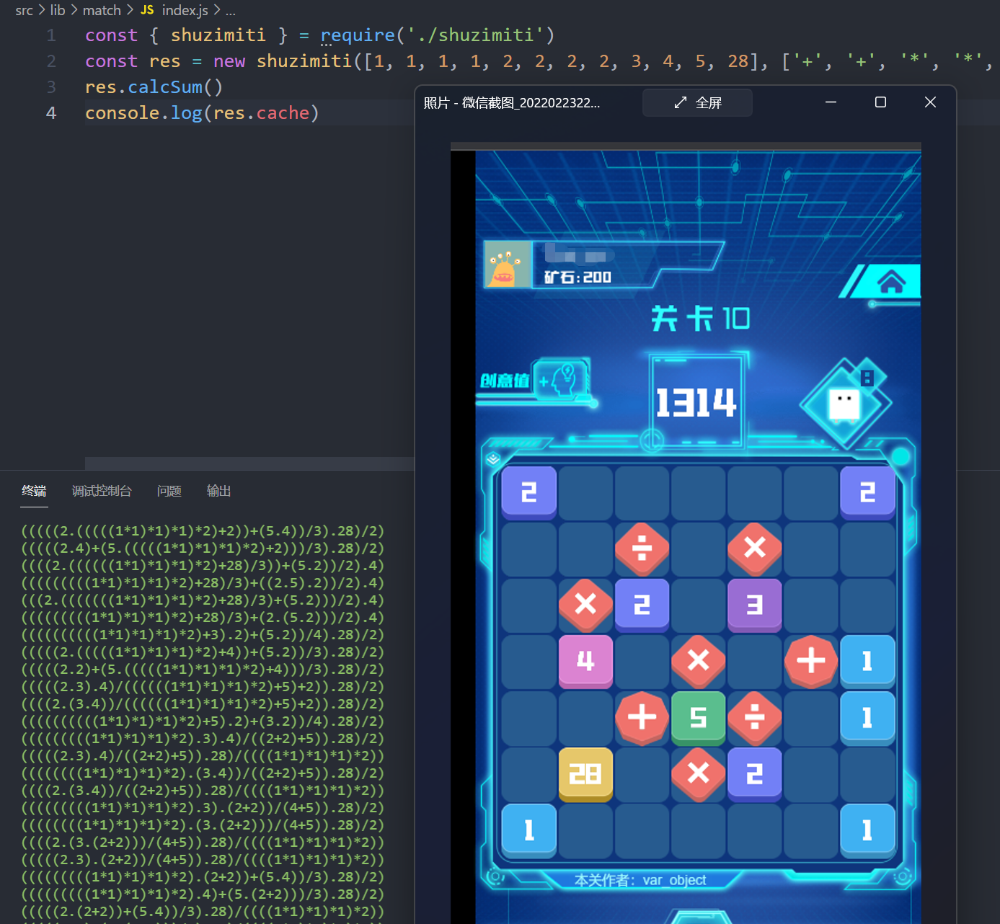
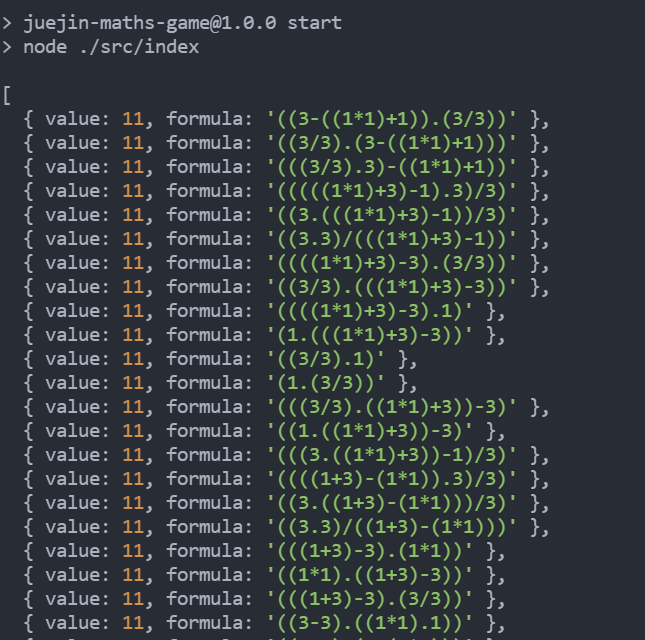

# 掘金游戏“数字谜题”算法助手
> 非外挂哦，只是最快速找到算法，仍需要根据算法手动完成游戏

某个夜黑风高的晚上，某程序员摸鱼时无意间发现到了JJ的新游戏，玩了一会不得不佩服JJ运营和技术的头脑，太烧脑了。  
模式上采用`共建`方式，既能收集题目又能调动参与，复杂的解体再加上变态的陷阱路线，简直SaoD不能再Sao。

基于某位掘友的算法，进行进一步改良和加工，仓库地址[juejin-maths-game](https://github.com/study-vue3/fast-vue3)  

感谢[wangscaler](https://github.com/wangscaler)提供的可视化地址：[http://math.wangscaler.com/](http://math.wangscaler.com/)

# 加强版
<a>

</a>

- 🎉 双模双待，自动读取关卡的数字，运算符，目标数字。
- 🧩 答案萃取，增加了对上百种结果的过滤和萃取，更加接近答案值。
- 🪂 钉钉PUSH，可以推到钉钉，手机电脑两步走
- 🧬 优化了Maths库ing，针对`.`合并运算符进行解析处理
- 🤡 仅供学习，欢迎一起完善`Game`的自动寻路功能


# 模式
>有两种模式分别是手动和自动,针对不同的使用场景可自由切换，默认为自动模式

`手动模式`,需要自己根据游戏关卡展示的`数字`,`结果`,`字符`输入到`命令`,然后运行，此模式不需要`COOKIE和UID`
```javascript
# src/index.js
handleRunning([1,2,3,4], ['/', '*', '-'], 10)
```

`自动模式`，根据用户的信息自动登录游戏查询到关卡数据，并且直接运行解析算法，给出正确结果。如果通关，再次执行自动模式命令即可。  
```javascript
# src/index.js
autoRunning()

```

# 使用

`.env` 不要fork,不上上传你的数据，本地跑就可以
```
# 用户cookie
COOKIE=
# 用户ID，随便url可查
USERID=
# 钉钉机器人
DINGTALK_WEBHOOK=
# 钉钉机器人密钥
DINGTALK_SECRET=
```

```sh
# clone 
$ git clone  https://github.com/study-vue3/fast-vue3.git

# pnpm/yarn/npm均可安装
$ pnpm install

# 运行
$ npm run start
```

<a>

</a>

# 最后
-   欢迎加群前端水友群，大家一起划水，因为讨论技术和装X的都被T出去了，那么我们就一起水吧。 加微信，备注来源和姓名，拉进入群。
-   前沿技术，各类体验、互动相关的技术，各类译文、研报的提前透视。

<p>

</p>
<p>

</p>
